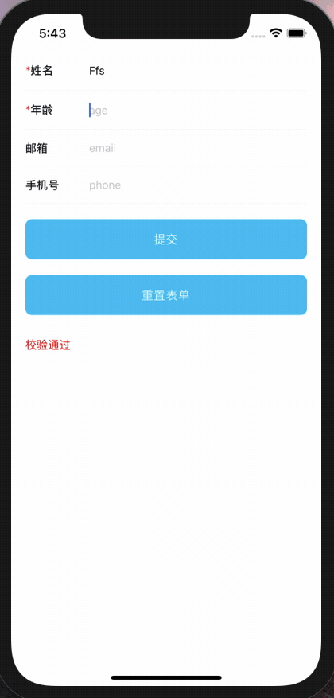

## 评审组件
* react-native Form、FormItem 组件
* Hook useFormStore


## 功能亮点

* 解决 react-native 复杂表单校验
* 支持动态添加表单项
* 支持校验单个属性 
* 写法属性靠近 Vue 
* 支持联动校验


## 基本使用

```typescript
import { RuleItem, Rules } from 'async-validator';
import React, { ReactElement, useRef, useState } from 'react';
import {
  SafeAreaView,
  StyleSheet,
  Text,
  View,
  TextInput,
  TouchableOpacity
} from 'react-native';
import { Form, FormItem } from './src/index'
import useFormStore from './src/useFormStore'


const rules: Rules = {
  name: [
    { required: true, message: '请输入姓名' },

  ],
  age: [
    { required: true, message: '请输入年龄' },
  ],
  email: [
    {
      type: 'email', message: '请输入正确邮箱地址'
    }
  ],
  phone: []
}

const App: () => ReactElement = () => {

  const ref = useRef<ObjectType>()

  const { formData, setValue, resetForm } = useFormStore({})
  const [passed, setPassed] = useState(true)
  const [emailRules, setEmailRules] = useState<Array<RuleItem>>([])
  const [phoneRules, setPhoneRules] = useState<Array<RuleItem>>([])

  const handleSubmit = () => {
    ref.current?.validate((res: boolean) => {
      console.log(res)
      setPassed(res)
    })
  }

  const handleResetForm = () => {
    resetForm()
    setEmailRules([])
    setPhoneRules([])
    ref.current?.clearValidate()
  }

  const handleValidateProp = (prop: string) => {
    ref.current?.validateField(prop, (res: boolean) => {
      setPassed(res)
    })
  }


  return (
    <SafeAreaView >
      <View style={{ paddingHorizontal: 18 }}>
        <Form data={formData} rules={rules} labelWidth={80} ref={ref}>
          <FormItem label="姓名" prop="name" rules={[{ max: 12, min: 2, message: '长度在2-12' }]}>
            <TextInput
              style={{ flex: 1 }}
              value={formData.name}
              placeholder="name"
              onChangeText={text => setValue('name', text)}
              onBlur={() => { handleValidateProp('name') }}
            />
          </FormItem>
          <FormItem label="年龄" prop="age">
            <TextInput
              style={{ flex: 1 }}
              value={formData.age}
              placeholder="age"
              onChangeText={text => setValue('age', text)}
              onBlur={() => { handleValidateProp('age') }}
            />
          </FormItem>
          <FormItem
            label="邮箱"
            prop="email"
            rules={emailRules}
          >
            <TextInput
              style={{ flex: 1 }}
              value={formData.email}
              placeholder="email"
              onChangeText={text => {
                setValue('email', text)
                if (text) {
                  setPhoneRules([{ type: 'string', message: '请输入手机号', required: true }])
                } else {
                  setPhoneRules([])
                }
              }}
              onBlur={() => { handleValidateProp('email') }}
            />
          </FormItem>
          <FormItem
            label="手机号"
            prop="phone"
            rules={phoneRules}
          >
            <TextInput
              style={{ flex: 1 }}
              value={formData.phone}
              placeholder="phone"
              onChangeText={text => {
                setValue('phone', text)
                if (text) {
                  setEmailRules([{ message: '请输入邮箱', required: true }])
                } else {
                  setEmailRules([])
                }
              }}
              onBlur={() => { handleValidateProp('phone') }}
            />
          </FormItem>
        </Form>
        <TouchableOpacity onPress={handleSubmit} style={styles.btn}>
          <Text style={styles.btnText}>
            提交
          </Text>
        </TouchableOpacity>
        <TouchableOpacity onPress={handleResetForm} style={styles.btn}>
          <Text style={styles.btnText}>
            重置表单
          </Text>
        </TouchableOpacity>
        <Text style={{ marginTop: 30, color: 'red' }}>
          {passed ? '校验通过' : '校验不通过'}
        </Text>
      </View>
    </SafeAreaView >
  );
};

const styles = StyleSheet.create({
  btn: {
    backgroundColor: '#00B9EF',
    borderRadius: 8,
    marginTop: 20,
    height: 50,
    justifyContent: 'center',
    alignItems: 'center'
  },
  btnText: {
    color: "#fff",
    fontSize: 15,

  }
});

export default App;

```


## useFormStore

| 属性           | 说明                                                   |
| -------------- | ------------------------------------------------------ |
| formData       | 表单数据对象                                           |
| setValue       | 设置表单属性值，可使用对象批量设置                     |
| getValue       | 获取表单某个属性值，未设置参数属性则返回整个 form 表单 |
| resetForm      | 重置表单，若未设置默认表单则重置为{}                   |
| setForm        | 设置表单                                               |
| setDefaultForm | 设置默认表单                                           |


## 校验规则常考 [CheckRules](https://www.npmjs.com/package/async-validator "async-validator")

## Form Attributes

| 参数                 | 说明                    | 类型    | 可选值 | 默认值 | 是否必选 |
| -------------------- | ----------------------- | ------- | ------ | ------ | -------- |
| data                 | 表单数据对象            | Obeject | --     | {}     | 否       |
| rules                | 表单校验规则            | Object  | --     | {}     | 否       |
| labelWidth           | FormItem组件label的宽度 | Number  | --     | 80     | 否       |
| showBorder           | 是否显示下划线          | Boolean | --     | true   | 否       |
| hideRequiredAsterisk | 是否隐藏必填 * 号       | Boolean | --     | false  | 否       |

## FormItem  Attributes

| 参数                 | 说明              | 类型    | 可选值               | 默认值 | 是否必选 |
| -------------------- | ----------------- | ------- | -------------------- | ------ | -------- |
| prop                 | 表单属性          | --      | --                   | --     | 否       |
| label                | 标签文本          | String  | --                   | --     | 否       |
| labelWidth           | label的宽度       | Number  | --                   | 80     | 否       |
| labelPosition        | label的对齐方式   | String  | left \| right \| top | left   | 否       |
| hideRequiredAsterisk | 是否隐藏必填 * 号 | Boolean | --                   | false  | 否       |
| rules                | 校验规则          | Array   | --                   | []     | 否       |
| style                | 样式              | Object  | --                   | {}     | 否       |
| showBorder           | 是否显示下划线    | Boolean | --                   | true   | 否       |

##  Form  Methods

| 方法名        | 说明             | 参数                                             |      |      |      |
| ------------- | ---------------- | ------------------------------------------------ | ---- | ---- | ---- |
| validate      | 校验所有表单     | Function(boolean,errList) 可选                   |      |      |      |
| validateField | 校验单个属性     | Prop:需要校验的属性(必填)，Function(boolean)可选 |      |      |      |
| clearValidate | 移除所有校验结果 | --                                               |      |      |      |


## 演示

